# LEventDelegate

**NOTE!!!** LEventDelegate is part of LGUI plugin as an individual module, if you already have LGUI then no need to buy LEventDelegate!

LEventDelegate (Lex-EventDelegate) is a callback method (excuted when the event is triggered), which can edit inside "Details" panel and serialize as asset, just like Unity's UnityEvent.  

## How to use
### LEventDelegate without parameter
Create a ActorComponent blueprint class, name it "MyLEventDelegateTest", this component will hold the LEventDelegate and execute it:  
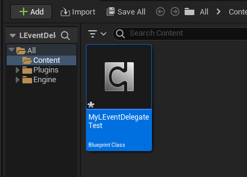

Double click MyLEventDelegateTest to open the blueprint editor, then create a variable of type LEventDelegateEmpty, name it "MyEvent", check on "InstanceEditable", then compile the blueprint:  
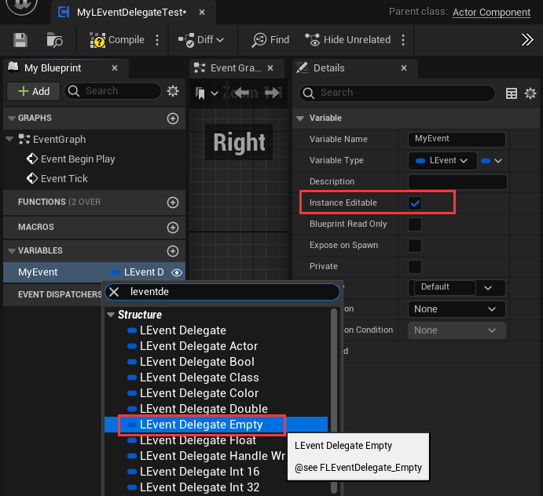

Create another ActorComponent blueprint class, name it "FunctionComponent", this component will provide the function to call by LEventDelegate:  
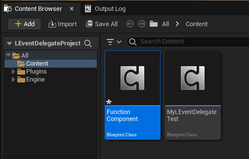

Double click FunctionComponent to open the blueprint editor, add a function with name "TestFunction", add input paramter of type String, link a "Print String" node to the function, then compile the blueprint:  

Create two actor with name "A" and "B":
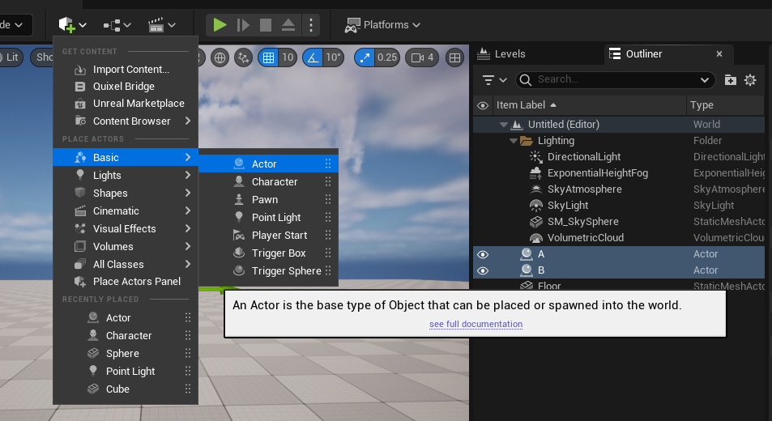

Add MyLEventDelegateTest to actor A, and FunctionComponent to actor B:
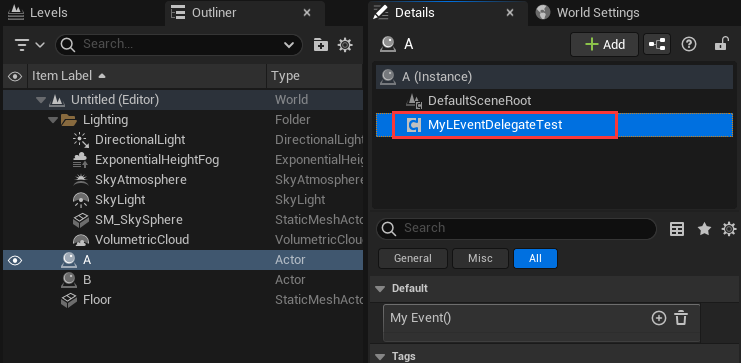

Select MyLEventDelegateTest component on actor A, in the Details panel you will find LEventDelegate "My Event()" that just created, click the "+" button to add a event item:  

Keep MyLEventDelegateTest component selected, and click the lock icon button on the Details panel to make it locked up, this can let us drag other actor in Outliner:  

Drag actor B to event parameter:  

Click component area, it will list all valid components and "(ActorSelf)", select "Function" component because our "TestFunction" is inside FunctionComponent:  

Click function area, it will list all compatible functions, select "TestFunction(String)" which created before:  
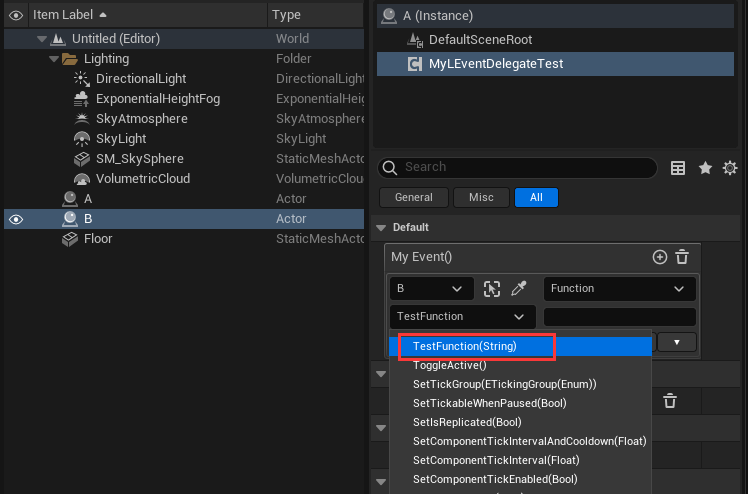

The parameter area now shows a string input field, when we do execute the "My Event()" LEventDelegate, the string that we typein will convert to a parameter and pass to the executed functon. You can typein anything, for example just typein "I am function parameter":  

Now the callback method setup is complete, the next step is to execute the "My Event()" LEventDelegate. Double click MyLEventDelegateTest component, in the blueprint editor drag "MyEvent" variable to EventGraph, then drag out a line from "MyEvent" node and select "Execute" node:  

Add a "Delay" node and set "Duration" to 0.5, compile blueprint:  

Hit play and a print message "I am function parameter" will show on viewport's left top area:  
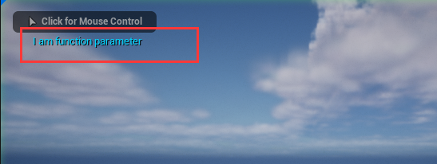

### LEventDelegate with parameter
Mostly we want to pass parameter with event, LEventDelegate can do it too, let's try it.
Open MyLEventDelegateTest in blueprint editor, change "MyEvent" type to LEventDelegateString:

Now the "Execute" node link is broken because the parameter not match:

We need to use other "Execute" node with parameter of string. So break the error link and delete "Execute" node, then drag out from "MyEvent" and select "Execute" again, this time the "Execute" node get a string parameter:
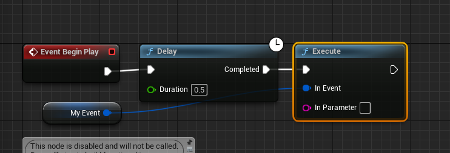

Typein "I am native function parameter" in "In Parameter":
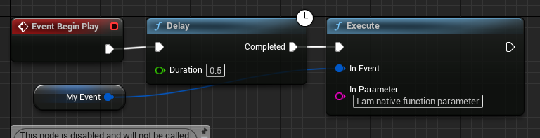

Select MyLEventDelegateTest component in actor A, in "MyEvent" section click "+" to add a new event, then drag actor B to event parameter's actor area, and select "Function" component in component area:
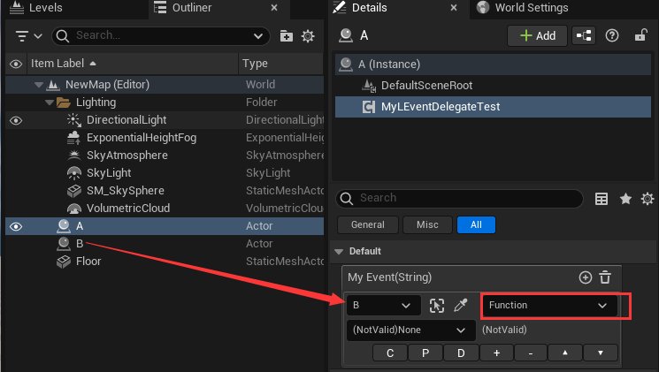

Click function area, you will find two functions of name "TestFunction", the one with "NativeParameter" will pass native parameter, so we select it:

You will see the parameter area shows a text "NativeParameter":
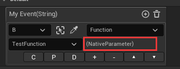

Hit play and a print message "I am native function parameter" will show on viewport's left top area:  

LEventDelegate support a lot of basic data types list below, you can use them with type LEventDelegateXXX (eg LEventDelegateString, LEventDelegateBool):
|Name|Description
|:-|:-
|Empty|Empty parameter
|Bool|Boolean
|Float|Single precision float
|Double|Double precision float
|Int8|8 bit integer (c++ only)
|UInt8|Unsinged 8 bit integer (also for enum and byte type)
|Int16|16 bit integer (c++ only)
|UInt16|Unsinged 16 bit integer (c++ only)
|Int32|32 bit integer
|UInt32|Unsinged 32 bit integer (c++ only)
|Int64|64 bit integer (c++ only)
|UInt64|Unsinged 64 bit integer (c++ only)
|Vector2|2D vector, double precision float for each component
|Vector3|3D vector, double precision float for each component
|Vector4|4D vector, double precision float for each component
|Color|4 byte color, 1 byte for each rgba channel
|LinearColor|16 byte color, single precision float for each rgba channel
|Quaternion|Quaternion as rotation value, known as FQuat
|Rotator|Rotator as rotation value
|Name|Known as FName
|Text|Known as FText
|String|Known as FString
|Object|Represent for any UObject, mostly for asset reference
|Actor|Actor reference in level
|Class|UClass reference

If you use a LEventDelegateXXX, when select function from list, you may see some function with "(NativeParameter)" (eg. TestFunction(NativeParameter)):  

This means the function can receive parameter that passed from LEventDelegate.  

### Register event at runtime
You can also use LEventDelegate as traditional way like Register/Unregister:
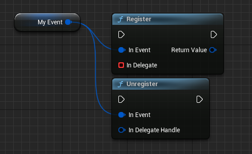

## Extra Info
After setup a LEventDelegate and try to execute it, it will search function receiver object on target actor (function receiver object could be the actor itself or one of component on the actor), find function that match the function name and parameter type, and then call the function with parameter value. And LEventDelegate have built-in cache, means it only do these search things once at the first time it is executed.  

## Function Buttons
Every event item editor have these function buttons that can help use easily setup our events:  
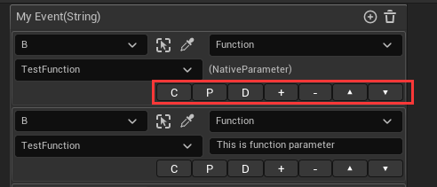
|Name|Function
|:-|:-
|C|Copy this event item to memory
|P|Paste the copied event item data to this one
|D|Duplicate this event item to a new one
|+|Add a new event item after this one
|-|Remove this event item
|▲|Move this event item up
|▼|Move this event item down

## Known Limitations
- Not support use inside ActorBlueprint's component.
- Currently only support one parameter or no parameter.
