# LEventDelegate

**注意!!!** LEventDelegate是LGUI插件的一个独立模块，如果您已经有了LGUI插件，那么就不需要再买LEventDelegate！  

LEventDelegate (Lex-EventDelegate) 是个回调事件工具（当事件触发的时候执行方法），可以在物体的“Details”栏中编辑并且序列化为asset，用法就和Unity的UnityEvent类似。  

## 如何使用
### 空参数的LEventDelegate
创建个ActorComponent蓝图，命名为“MyLEventDelegateTest”，我们将在这个组件中创建LEventDelegate并使用：
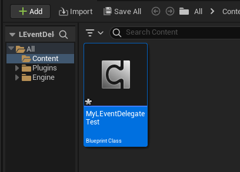

双击“MyLEventDelegateTest”打开蓝图编辑器，创建个变量类型为“LEventDelegateEmpty”，命名为“MyEvent”，勾选"InstanceEditable"，编译蓝图：  
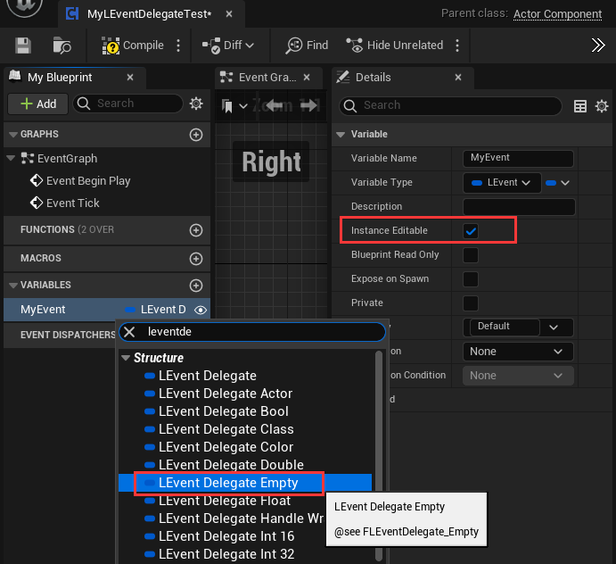

创建另一个ActorComponent蓝图，命名为"FunctionComponent"，我们将在这个组件中创建个方法用于LEventDelegate调用：  
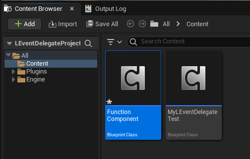

双击FunctionComponent打开蓝图编辑器，添加个函数“TestFunction”，添加个类型为String的输入参数，连接个“Print String”节点，编译蓝图：
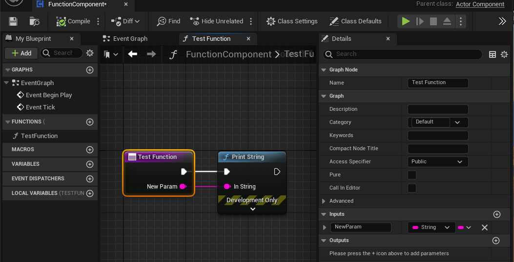

创建两个Actor分别命名为“A”和“B”：
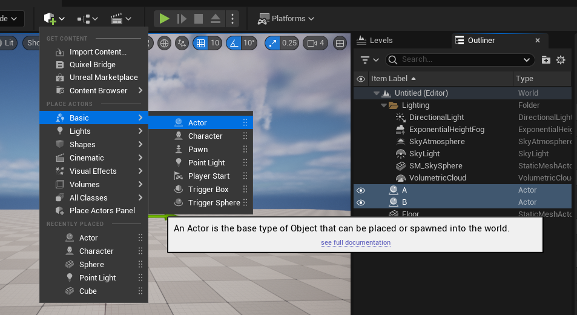

给A添加MyLEventDelegateTest组件，给B添加FunctionComponent组件：
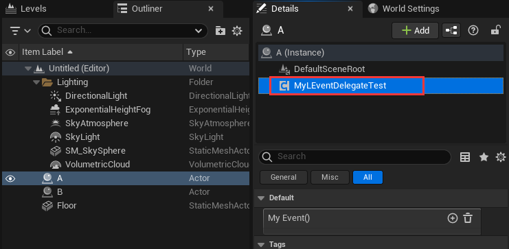
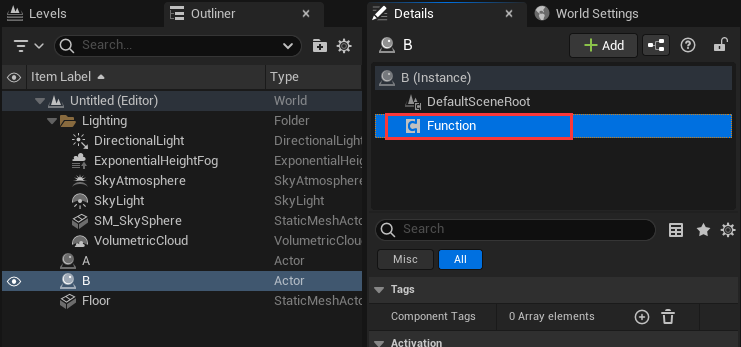

选择A上的MyLEventDelegateTest组件，在“Details”面板里可以看到刚才创建的“My Event()”的LEventDelegate，点击“+”按钮来添加一个事件：
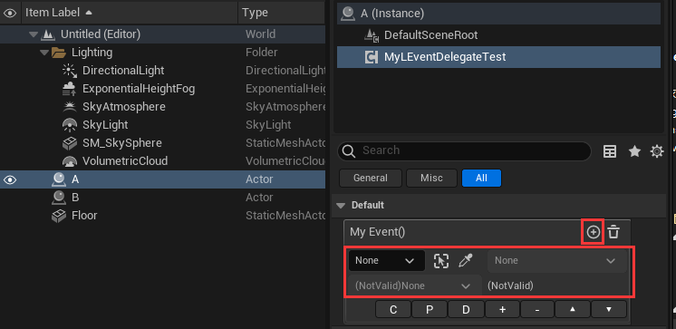

保持MyLEventDelegateTest组件选中，然后点击“Details”面板的锁按钮来锁住选择：
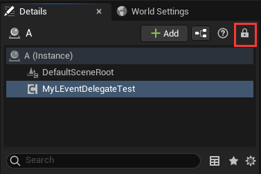

把B拖拽到事件参数里：
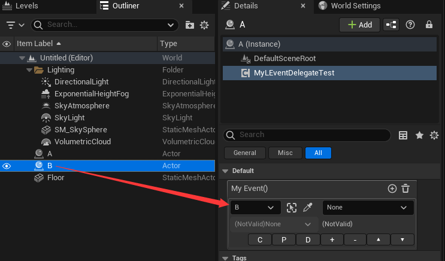

点击事件参数里的组件区域，这里会列出所有可用的组件和Actor自身“(ActorSelf)”，选择“Function”组件，因为我们的“TestFunction”函数在FunctionComponent组件里：
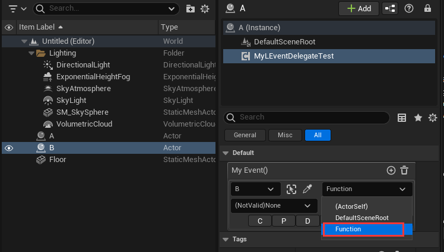

点击事件参数里的方法区域，这里会列出所有可用的方法，选择我们刚才创建的“TestFunction(String)”：
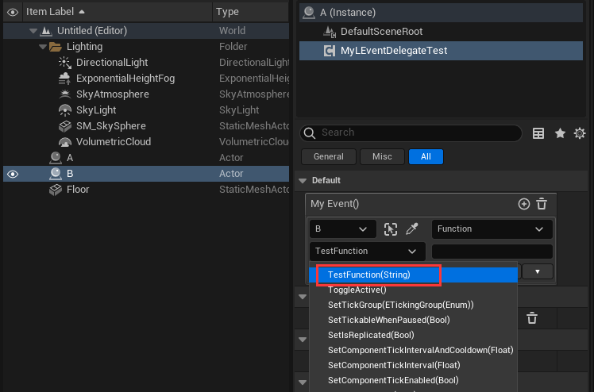

参数区域现在显示为字符输入框，当我们执行“MyEvent()”事件的时候，我们在这里输入的字符将会转为参数并传给目标函数。你可以输入任何内容，例如我们在这里输入“I am function parameter”：
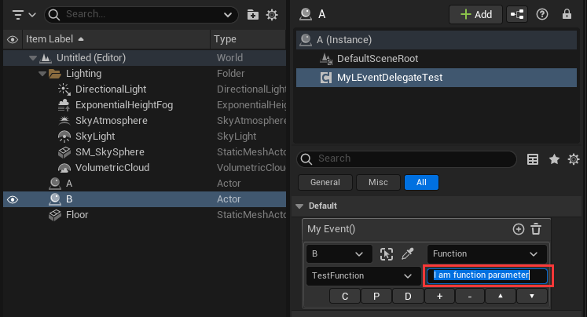

现在这个事件已经设置完成了，下一步就是执行它了。双击MyLEventDelegateTest组件，在蓝图编辑器里把“MyEvent”变量拖到EventGraph，然后从“MyEvent”节点拖出并连接“Execute”节点：
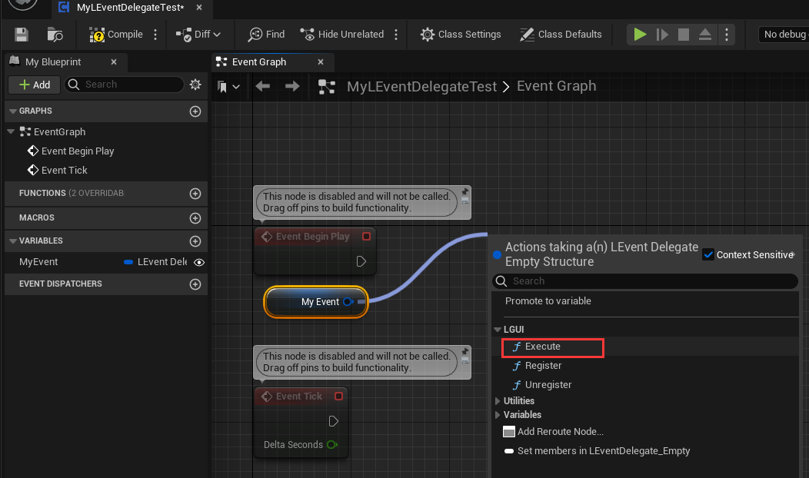

添加个“Delay”节点并设置“Duration”为0.5，编译蓝图：
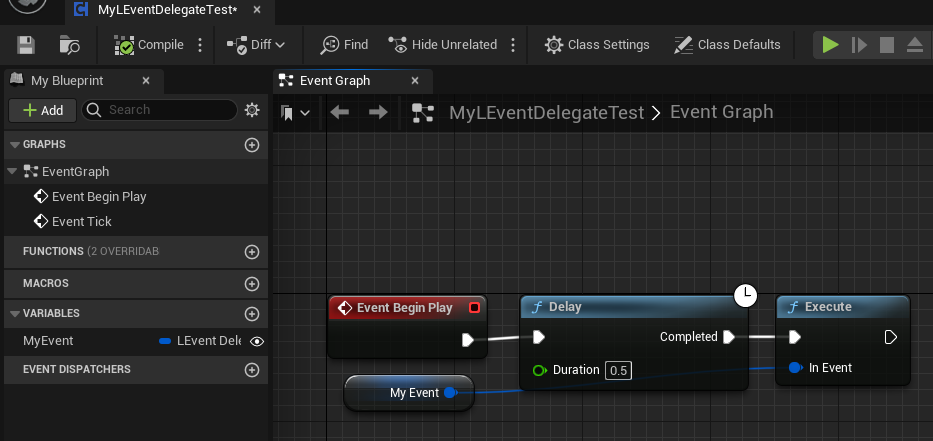

点击运行，可以看到打印的字符信息“I am function parameter”显示在屏幕左上方：
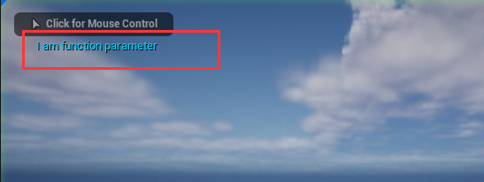

### 有参数的LEventDelegate
实际上大部分情况下我们都想通过事件来传递参数，LEventDelegate也可以做到，我们来试试。
在蓝图编辑器里打开MyLEventDelegateTest，修改“MyEvent”类型为LEventDelegateString：
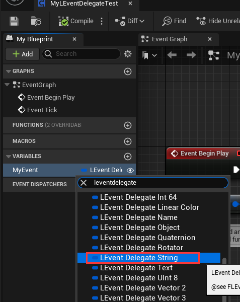

改完之后“Execute”节点显示为出错因为参数不匹配：
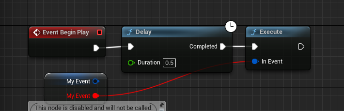

我们可以用另一个带string参数的“Execute”节点。打断错误节点并删除“Execute”节点，然后从“MyEvent”节点拖出线并再次选择“Execute”，这次“Execute”节点就有string参数了：
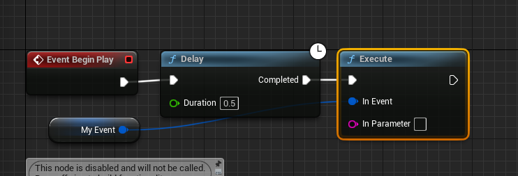

在“In Parameter”中输入“I am native function parameter”：
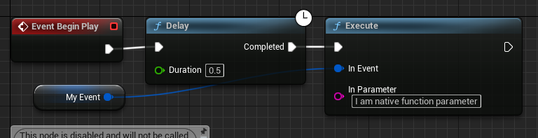

在A上选择MyLEventDelegateTest组件，在“MyEvent”中点击“+”按钮来添加事件，然后把B拖到事件参数中的actor区域，然后在组件区域中选择“Function”组件：
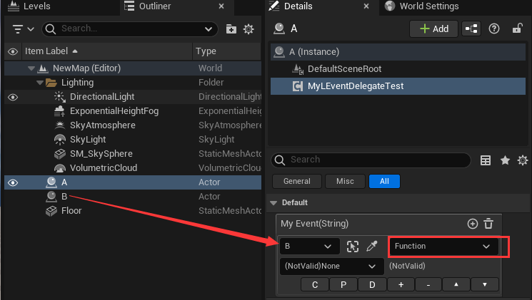

点击函数区域，你可以看到有两个名为“TestFunction”的函数，带有“NativeParameter”的函数可以传递事件的参数，所以我们选择它：
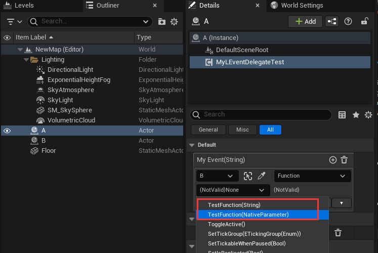

你可以看到事件的参数区域显示个文字“NativeParameter”：
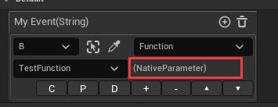

点击运行，可以看到打印的字符信息“I am native function parameter”显示在屏幕的左上方：
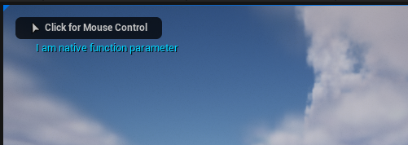

LEventDelegate支持很多基础数据类型，下面列表中都是。你可以通过使用LEventDelegateXXX来使用这些类型（比如 LEventDelegateString、LEventDelegateBool）：
|名字|描述
|-|-
|Empty|空参数
|Bool|布尔值
|Float|单精度浮点小数
|Double|双精度浮点小数
|Int8|8位整数 (c++ only)
|UInt8|无符号的8位整数 (also for enum and byte type)
|Int16|16位整数 (c++ only)
|UInt16|无符号16位整数 (c++ only)
|Int32|32位整数
|UInt32|无符号32位整数 (c++ only)
|Int64|64位整数 (c++ only)
|UInt64|无符号64位整数 (c++ only)
|Vector2|2D 向量，双精度
|Vector3|3D 向量，双精度
|Vector4|4D 向量，双精度
|Color|4字节颜色值，rgba每个通道使用1字节
|LinearColor|16字节颜色值，rgba每个通道使用4字节的单精度浮点小数
|Quaternion|表示旋转的四元素，即c++中的FQuat
|Rotator|表示旋转的Rotator
|Name|即c++中的FName
|Text|即c++中的FText
|String|即c++中的FString
|Object|代表任何UObject，大部分时候用于资源引用
|Actor|场景中的Actor引用
|Class|UClass引用

如果你使用LEventDelegateXXX，当你从函数列表中选择时，你可以看到一些函数带有“(NativeParameter)”（比如 TestFunction(NativeParameter)）：

这就代表这个函数可以接收从LEventDelegate传入的参数。

### 运行时注册事件
你在用LEventDelegate的时候也可以传统一点的方式比如注册或注销（Register/Unregister）：
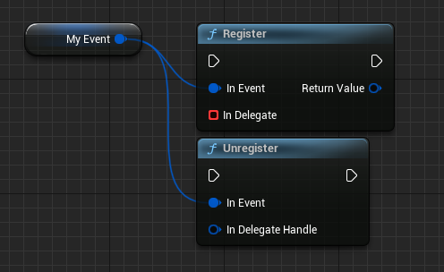

## 额外说明
当设置好LEventDelegate并调用的时候，它会在目标Actor上找到接收事件的物体（接收事件的物体可以是Actor自身或Actor的Component），根据参数和函数名找到适配的函数，然后调用函数。并且LEventDelegate有内置的缓存，就是说只有在第一次执行函数的时候才会有这些搜索工作，后面就是直接执行了。

## 功能按钮
每个事件元素都有些功能按钮：
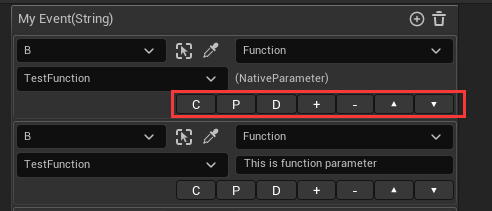
|名字|功能
|:-|:-
|C|复制这个事件元素到内存中
|P|把内存中复制的事件元素粘贴到当前这个事件元素上
|D|复制这个事件元素为一个新的事件元素
|+|在当前这个事件元素后面添加一个新的事件元素
|-|删除当前这个事件元素
|▲|把当前这个事件元素往上移一位
|▼|把当前这个事件元素往下移一位

## 已知限制
- 不支持Actor蓝图中的组件中使用。
